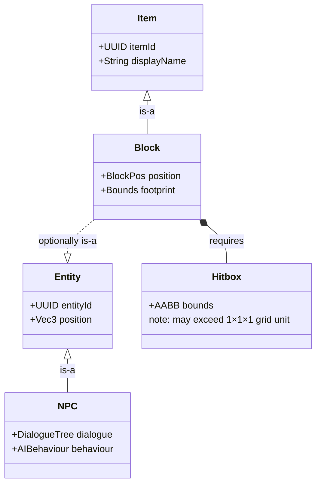

# Glyphworks

A Hytale server plugin built around a **typed, extensible grid network system** — any block can become a node in a named grid, and multiple independent grid types (item transfer, fluid, energy, …) can coexist in the same world. The first concrete grid type being developed is **Item** transfer.

---

## Concept

Every participating block carries a `GridComponent` that declares which **grid type** it belongs to and what faces are exposed for connections. Blocks of the same type that share a compatible face-pair are automatically linked into an undirected graph. Pipes are ordinary grid nodes that carry no payload of their own; they simply extend the graph so machines and storage blocks can reach each other across space.

```
[ Furnace (OUTPUT) ] ──pipe──> [ Chest (INPUT) ]

[ Farm (OUTPUT) ]
        │
       pipe
        │
        ├──> [ Storage A (INPUT) ]
        └──> [ Storage B (INPUT) ]
```

---

## Grid Types

Grid types are registered at plugin initialisation and serve as namespaces that keep otherwise identical blocks from accidentally cross-connecting:

```java
GridTypeRegistry.register(GridType.of("Item"));
```

Each world holds one `GridGraph` per registered type. A block declares its type through `GridComponent_Type` in its item JSON.

---

## Grid Nodes

Every block that participates in any grid carries a **`GridComponent`**:

| Field | Description |
|---|---|
| `gridType` | The `GridType` this node belongs to. Determines which graph it enters. |
| `faces` | Set of `FacePlane` entries that describe every connectable surface of this block. |
| `neighbors` | World-position set of all currently linked adjacent blocks. Persisted in the chunk store. |

---

## Face Modes

Each `FacePlane` has a `FaceMode` that governs whether and how it participates in connections:

| Mode | Description |
|---|---|
| `INPUT` | This face only receives. Connects to adjacent OUTPUT or BIDIRECTIONAL faces. |
| `OUTPUT` | This face only sends. Connects to adjacent INPUT or BIDIRECTIONAL faces. |
| `BIDIRECTIONAL` | This face both sends and receives. Compatible with any non-CLOSED mode. |
| `CLOSED` | This face does not connect. No edge is formed. |

Two faces are linkable when they are spatially adjacent, carry opposite world-space normals (face each other), and their modes are compatible — two INPUTs or two OUTPUTs cannot link to each other.

Multi-block structures expose one `FacePlane` per outer surface cell. The `FacePlane.position` field is a block-origin-relative offset that points to the correct filler cell, and `FacePlane.normal` is the outward direction in local/JSON space. Both are rotated to world space at runtime using the block's `RotationTuple` so rotated placements connect correctly.

---

## Pipes

**Pipes** (`Pipe`) are 1×1×1 `Item`-type grid nodes with six `BIDIRECTIONAL` faces — one per direction. They carry no payload; their only role is to extend the graph.

Pipes use Hytale's **connected-block system** (`PipeConnectedBlockRuleSet`) to automatically select the correct visual model variant based on which of their six faces has a linked neighbour at any given moment. All 64 direction-set combinations (bitmask of N/S/E/W/U/D) map to a named state in `Pipe.json`; the rule set resolves the state name at runtime and returns the matching block-type key.

### Pipe state naming

States are named by concatenating the active direction letters in declaration order:

| Active faces | State name |
|---|---|
| None | `Single` |
| North only | `N` |
| North + South | `NS` |
| North + South + Up | `NSU` |
| All six | `NSEWUD` |
| … | … (64 states total) |

---

## Runtime Graph

`GridGraph` is an in-memory, position-keyed undirected graph that is **not serialised**. It is rebuilt entirely from the persisted `GridComponent.neighbors` sets as chunks load. One `GridGraph` instance exists per world per registered grid type.

```
GridGraph
  pos → { neighbor positions … }
  pos → { neighbor positions … }
  …
```

Operations: `addNode`, `removeNode`, `addEdge`, `removeEdge`, `getNeighbors`, `getComponent` (BFS connected-component), `getEdgeCount`.

---

## Block Lifecycle

Four event handlers keep the persisted component data and the runtime graph in sync:

| Event | Handler | Action |
|---|---|---|
| `PlaceBlockEvent` | `PlaceGridBlockEvent` | Scans all faces of the placed block, finds compatible neighbours of the same grid type, records positions in both `GridComponent.neighbors`, and adds the node + edges to `GridGraph`. |
| `BreakBlockEvent` | `BreakGridBlockEvent` | Removes the node from `GridGraph`, then removes its position from every neighbour's `neighbors` set. Connected-block updates are deferred so the pipe shapes of neighbours refresh after the block entity is gone. |
| `ChunkPreLoadProcessEvent` | `ChunkLoadGridGraphEvent` | Iterates every `GridComponent` in the loading chunk and re-adds nodes and their persisted edges to the `GridGraph`. Cross-chunk edges are completed naturally as each chunk loads. |
| `ChunkUnloadEvent` | `ChunkUnloadGridGraphEvent` | Removes all nodes in the unloading chunk from their `GridGraph`. Persisted `neighbors` are untouched so the graph can be reconstructed on the next load. |

`GridLookup.resolve(chunkStore, pos)` transparently follows filler-cell redirections, so all event handlers work correctly for multi-block structures without special-casing.

---

## Tick System

`GridSystem` is a `EntityTickingSystem` registered against the `GridComponent` query. It currently dispatches no behaviour. Once a grid-type behaviour registry is introduced, each type will register its own per-tick logic (e.g. the Item type will traverse the graph and move item stacks between connected source and sink nodes).

---

## Debug Command

`/glyphgraph [--type <id>] [--verbose]`

Prints the in-memory grid graph for the current world.

- No flags: one summary line per registered type showing node count, edge count, and connected component count.
- `--type <id>`: restrict output to that type.
- `--verbose`: also list every node position and its direct neighbours.

---

## Game Object Model



- **Block** is always an **Item** (can be picked up, placed from inventory).
- **Item** does not need to be a **Block** (consumables, tools, etc.).
- **Block** can optionally be an **Entity** (e.g. a machine with tick behaviour, health, AI).
- **Entity** does not need to be a **Block** (mobs, projectiles, etc.).
- **NPC** is always an **Entity**.
- Every **Block** requires a **Hitbox**; hitboxes are not constrained to a single 1×1×1 grid unit.

---

## Project Structure

```
src/main/java/dev/drav/glyphworks/
├── GlyphworksPlugin.java               — plugin entry point, component + system registration
├── content/
│   └── connectedblocks/
│       └── PipeConnectedBlockRuleSet.java  — maps active-face bitmask to pipe model variant
└── grid/
    ├── command/
    │   └── GridGraphCommand.java           — /glyphgraph debug command
    ├── component/
    │   ├── FaceMode.java                   — enum: INPUT, OUTPUT, BIDIRECTIONAL, CLOSED
    │   ├── FacePlane.java                  — a face region: position + normal + mode, with codec
    │   └── GridComponent.java              — per-block node: grid type, faces, persisted neighbours
    ├── event/
    │   ├── PlaceGridBlockEvent.java        — links new block into the graph on placement
    │   ├── BreakGridBlockEvent.java        — removes block and its edges on break
    │   ├── ChunkLoadGridGraphEvent.java    — rebuilds graph entries on chunk load
    │   └── ChunkUnloadGridGraphEvent.java  — prunes graph entries on chunk unload
    ├── graph/
    │   └── GridGraph.java                  — runtime position-keyed adjacency graph (not serialised)
    ├── lookup/
    │   └── GridLookup.java                 — resolves GridComponent from world pos, filler-aware
    ├── system/
    │   └── GridSystem.java                 — per-tick system stub; dispatches type-specific behaviour
    ├── type/
    │   ├── GridType.java                   — functional interface: id() string
    │   └── GridTypeRegistry.java           — static registry: id → GridType
    └── util/
        └── GridFaceUtil.java               — spatial helpers: offsets, face rotation, linkability

src/main/resources/
├── Common/Blocks/Glyphworks/
│   ├── Pipe/                           — pipe .blockymodel files (Single + one per state)
│   ├── IO/Inserter/                    — inserter block model
│   ├── IO/Extractor/                   — extractor block model
│   └── Bench/                          — auto-furnace bench model
└── Server/Item/Items/Glyphworks/
    ├── Pipe/
    │   ├── Pipe.json                   — pipe item + BlockEntity with GridComponent
    │   └── Pipe_Straight.json          — straight-variant item stub
    ├── IO/
    │   ├── Inserter.json               — inserter item stub
    │   └── Extractor.json              — extractor item stub
    └── Bench/
        └── Auto_Bench_Furnace.json     — automated furnace item stub
```
