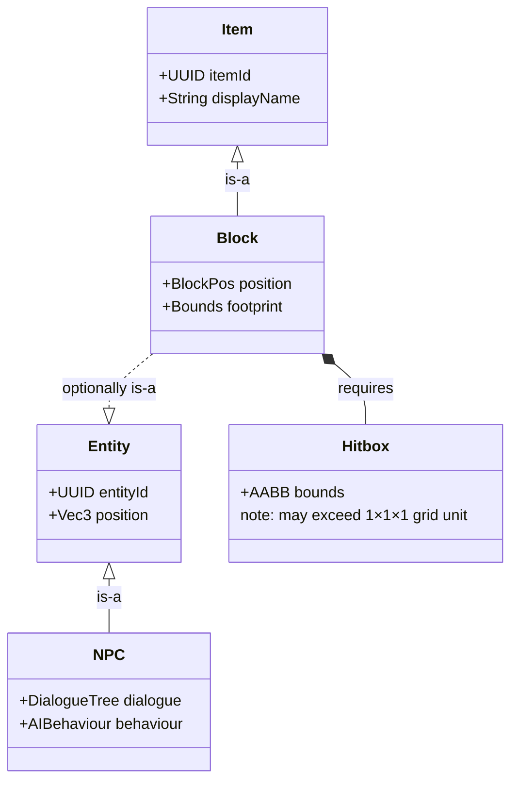

# Glyphworks

A Hytale server plugin that implements a **typed, extensible grid network system**. Any block can become a node in a named grid, and multiple independent grid types can coexist in the same world.

---

## Build & Run

```bash
./gradlew build        # compile + jar
./gradlew runServer    # start local dev server
```

---

## Grid System

Blocks opt into a grid by carrying a `GridComponent` that declares their **grid type** and which faces are exposed for connections. Adjacent blocks of the same type with compatible faces are automatically linked into a graph that updates in real time as blocks are placed, broken, and as chunks load and unload.

### Face Modes

| Mode | Description |
|---|---|
| `INPUT` | Receives only. Connects to OUTPUT or BIDIRECTIONAL. |
| `OUTPUT` | Sends only. Connects to INPUT or BIDIRECTIONAL. |
| `BIDIRECTIONAL` | Sends and receives. Compatible with any non-CLOSED face. |
| `CLOSED` | Does not connect. |

---

## Grid Types

### Item

Moves item stacks between containers via pipes, inserters, and extractors.

| Block | Description |
|---|---|
| `Pipe` | Extends the Item grid. Visual model updates automatically based on connected faces (64 states). |
| `Inserter` | Pushes items from an adjacent container into the grid. |
| `Extractor` | Pulls items from the grid into an adjacent container. |

### Fluid

Moves fluid between tanks and other fluid-aware blocks.

| Block | Description |
|---|---|
| `Glyphworks_Fluid_Tank` | Stores fluid. Exposes configurable faces for grid connection. |
| `Glyphworks_Fluid_Pipe` | Extends the Fluid grid across space. |
| `Glyphworks_Fluid_Source` | Produces fluid into the grid (e.g. world fluid block). |
| `Glyphworks_Fluid_Sink` | Consumes fluid from the grid. |
| `Glyphworks_Fluid_Placer` | Places fluid blocks into the world from the grid. |
| `Glyphworks_Fluid_Remover` | Removes fluid blocks from the world into the grid. |

---

## Commands

### Debug

`/glyphgraph [--type <id>] [--verbose]`

Prints the in-memory grid graph for the current world. Without flags, shows a summary per registered type (node count, edge count, connected component count). `--verbose` lists every node and its neighbours.

### Test

```
/glyphworks:test run [--module=<name>] [--suite=<name>] [--test=<name>] [--no-cleanup]
/glyphworks:test purge
```

Aliases: `gw:test run`, `gw:test purge`. Operator-only.

`--no-cleanup` keeps the test world alive after the run so you can inspect it. Use `purge` to destroy all leftover test worlds.

---

## Testing

### Headless

Set `JAVA_TOOL_OPTIONS` before launching. The server exits automatically when the run finishes (`0` = all passed, `1` = any failure).

```powershell
# Run all tests
$env:JAVA_TOOL_OPTIONS="-Dglyphworks.test.all=true" ; ./gradlew runServer ; Remove-Item Env:JAVA_TOOL_OPTIONS

# Run a specific module
$env:JAVA_TOOL_OPTIONS="-Dglyphworks.test.module=smoke" ; ./gradlew runServer ; Remove-Item Env:JAVA_TOOL_OPTIONS

# Run a specific suite within a module
$env:JAVA_TOOL_OPTIONS="-Dglyphworks.test.module=smoke -Dglyphworks.test.suite=mySuite" ; ./gradlew runServer ; Remove-Item Env:JAVA_TOOL_OPTIONS

# Run a single test
$env:JAVA_TOOL_OPTIONS="-Dglyphworks.test.module=smoke -Dglyphworks.test.suite=mySuite -Dglyphworks.test.name=myTest" ; ./gradlew runServer ; Remove-Item Env:JAVA_TOOL_OPTIONS
```

---

## Game Object Model



- **Block** is always an **Item** (can be picked up, placed from inventory).
- **Item** does not need to be a **Block** (consumables, tools, etc.).
- **Block** can optionally be an **Entity** (e.g. a machine with tick behaviour, health, AI).
- **Entity** does not need to be a **Block** (mobs, projectiles, etc.).
- **NPC** is always an **Entity**.
- Every **Block** requires a **Hitbox**; hitboxes are not constrained to a single 1×1×1 grid unit.

